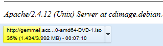

# Download Bar
by [hjgwmvya](https://github.com/hjgwmvya)

## Summery

This add-on shows an additional bar at the bottom of your browser, which contains all active and completed downloads.

## Screenshot

## Description

Download Bar is a simple add-on that shows you all active and completed downloads in an additional bar at the bottom of your browser.

Following informations are displayed for a download:

 * Download URL
 * Progress in percent and absolute bytes
 * Current download state
 * Time left

Following commands are possible for a download:

 * Pause/Resume download
 * Cancel/Retry download
 * Open download
 * Open download folder
 * Copy download URL
 * Remove download from Download Bar
 * Clean up Download Bar
 * Show all downloads

Completed downloads can be opened with a left click. Active downloads can be paused or resumed with a left click. Additional commands are accessible with a right click.

With Version 0.0.3 there are more options to customize Download Bar:

 * Font color, size and family can be changed
 * Button size and different state colors can be changed
 * Visibility of the close button can be set
 * Animations can be disabled
 * Behaviors can be customized

## License

[GPL-3.0](http://www.gnu.org/licenses/gpl-3.0-standalone.html)
